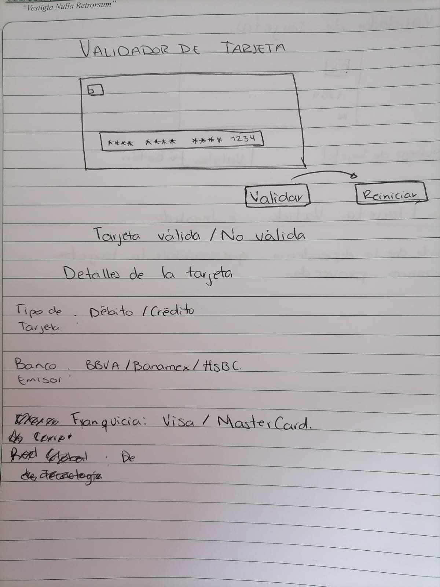
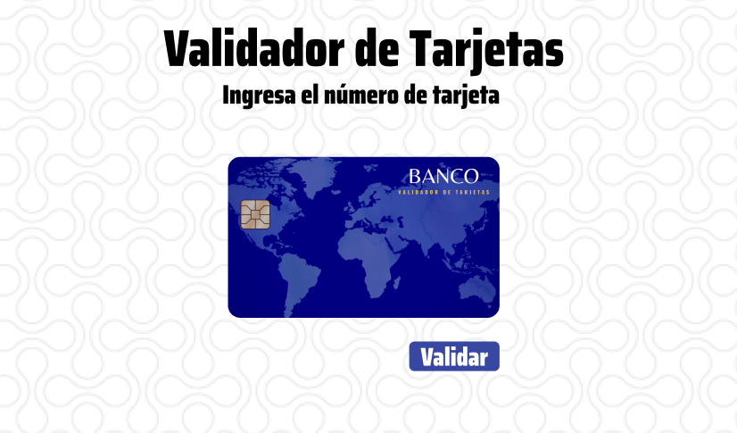

# Tarjeta de crédito válida

## VALIDADOR DE TARJETA
Es un sitio web que te permite saber si una tarjeta (crédito o débito) es válida o inválida.

## IMAGEN FINAL DEL PROYECTO 

## Investigación UX
Este verificador está pensado sobre todo en los usuarios que quieran saber la validez de una tarjeta de manera digital, puede ser algun vendedor para comprobar la vericidad de los datos de su cliente.

## PRIMER PROTOTIPO EN PAPEL

## IMAGEN PROTOTIPO FINAL
